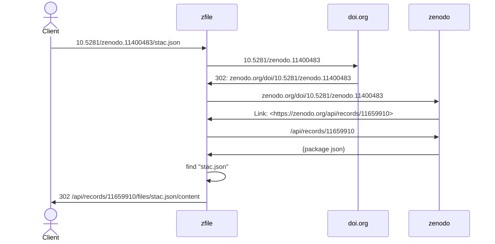

# zfile

A simple resolver and partial proxy service for published content on Zenodo.

zfile is a tiny FastAPI service that may help streamline access to published resources on Zenodo by using the resource DOI and a file name in the form of `DOI/filename`. This facilitates ease of reuse of artifacts published on Zenodo.



Given a DOI and file name, zfile splits the DOI and file name parts. ZFile resolves the DOI to the Zenodo location using the doi.org service. The Zenodo response at the resolved URL includes a Link header like:

```
link: <https://zenodo.org/api/records/11659910> ; rel="linkset" ; type="application/linkset+json"
```

Which indicates that the `linkset+json` representation of the resource is available at the specified URL. zfile sends a GET request to the linkset URL, and retrieves the linkset package in JSON. The linkset is examined for the requested file name, and if present, the client is redirected to that content URL. For file names ending in `.html`, `.js`, or `.css`, the resource is streamed directly to the client with the corresponding resource type. 

This enables resources on Zenodo to be conveniently referenced directly by URL. For example:

https://z.rslv.xyz/10.5281/zenodo.14291887/torus.html

versus the content URL for the same resource:

https://zenodo.org/api/records/14291887/files/torus.html/content


## Operation

zfile may be run locally. To do so, clone this repo, then:
```
cd zfile
poetry run python -m zfile
```

The service may then be accessed at http://localhost:4000/

zfile is also deployed on a very resource limited service at: https://z.rslv.xyz. It's availablility depends on use/abuse of the service.

## Usage

The service API is available at [`/api`](https://z.rslv.xyz/api). Two endpoints are supported:

`/DOI[/FNAME]` to access the resource.

and

`.info/DOI/[FNAME]` to access metadata about the resource.

The URL pattern is:

```
DOI[/FNAME]

DOI = The published DOI without embellishments, e.g. "10.5281/zenodo.11400483".
FNAME = The name of a file within the package.
```

Given only the DOI for a package, the service returns the linkset metadata from the [Zenodo records API](https://developers.zenodo.org/#records).

If the DOI and the name of a file within the package is given the service will either redirect to the content URL on Zenodo, or for some specific media_types, will proxy the content.
